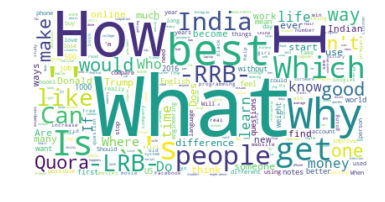

# Detecting Semantic Similarity in Questions

## Quick Links
- [About](#problem-statement)
- [Dataset](#dataset)
- [Setup](#setup)
- [Algorithms](#architectures-used)
	- [SVM](#support-vector-machine)
	- [Autoencoder](#autoencoder)
	- [Neural Network](#dense-neural-network)
	- [Siamese Models](#siamese-architecture)
- [Results](#results)
- [Analysis](#analysis)
- [References](#references)

## Problem Statement
We did this project as part of the course project of `Advanced Machine Learning.` 

In this project, we try to solve if two asked questions by users on CQA(Community Question Answering) platforms are duplicate or not. How one defines two questions as duplicate? We say two questions are duplicate if the users asking the questions have expressed similar ***intent***, i.e., users expect the same kind of answers to the questions asked.

Through this project, we aimed to model this ***intent***, i.e., given two questions classify if the purpose specified by the two questions are similar or not.

## Dataset
The dataset to be used for the study was published by [Quora](https://www.kaggle.com/c/quora-question-pairs/data), a Question-Answer platform not specific to any domain. We modified the dataset little-bit for the ease of use and saved all the models, which can be downloaded from [here](https://goo.gl/dYDK5Z).

The dataset contains 404,352 question pairs as per the format is given in the following table. `id` represents the unique question pair identifier. `qid1` and `qid2` represent the question identifier for first and the second question in the pair, respectively.  `question1` and `question2` are the full text of Question 1 and Question 2, respectively. `is_duplicate` is boolean variable, which signifies if both the questions are duplicate or not.

| id | qid1 | qid2 | question1 | question2 | is_duplicate |
|--|--|--|--|--|--|
| 447 | 895 | 896 | What are natural numbers? | What is the least natural number? | 0 |
| 1518 | 3037 | 3038 | Which pizzas are the most popularly ordered pizzas on Domino's menu? | How many calories does a Dominos pizza have? | 0 |
| 3272 | 6542 | 6543 | How do you start a bakery? | How do you start a bakery business? | 1 |
| 3362 | 6722 | 6723 | Should I learn python or Java first? | If I had to choose between learning Java and Python, what should I choose to learn first? | 1 |

Following is the wordcloud of top 2000 most frquently occuring words, clearly wh-questions dominate the dataset as expected from a CQA platform dataset.

 

## Setup

 - Install python >= 3.6 and pip
 - `pip install -r requirements.txt`
 - Download [GloVe word vectors](https://nlp.stanford.edu/projects/glove/) (glove.840B.300d)

## Architectures Used

### Support Vector Machine
SVM with Linear kernel was applied and used as a baseline for the classification task. Results from the model helped in better understanding of the data.
	
### Autoencoder
Question similarity can also be seen as a generative task of generating questions that are similar to the input. Therefore, these tasks can be modeled using Autoencoders, where the task is to learn a representation after the encoder such that the autoencoder minimizes the loss between the representation of two similar questions. For this task, the model was trained on only similar question pairs, and no comment can be made about the representation of non-similar question pairs. The following loss function `L` was minimized, where <code>X1</code> and <code>X2</code> represent the two similar questions in a pair, and `M()` is the autoencoder’s output. 

Later a classification layer was added to the concatenated output of two questions after the encoder layer. This network can also be seen as a siamese network where the representations are learned by an autoencoder based upon the similarity only. 

### Dense Neural Network
A `8-layered` vanilla cone-based neural network implemented for the dataset. We used `ReLU` activation function and trained the network for `100 epochs`. As it was binary classification task, final layer was of 2 neurons only.

 

### Siamese Architecture
In this architecture, the same neural network model is being used to encode two individual sentences which are given as input independently. Both the input sentences are now encoded into sentence vector in the same embedding space, as shown in Figure 1. Then by using some distant metric decision will be made solely based on this result.

 

## Results
| Algorithm | Accuracy | Embedding type |
|--|--|--|
| Support Vector Machine | 59.23% | doc2vec |
| Autoencoder | 62.85% | doc2vec |
| Neural Network | 79.28% | doc2vec |
| Convolutional Siemese | 64.33% | doc2vec |
| LSTM Siemese | 80.32% | word2vec |

## Analysis

## References

## Project Members

 1. [Arpan Mukherjee](https://github.com/arpanmukherjee)
 2. [Prabhat Kumar](https://github.com/prabhatkumar95)
